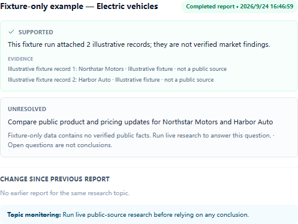
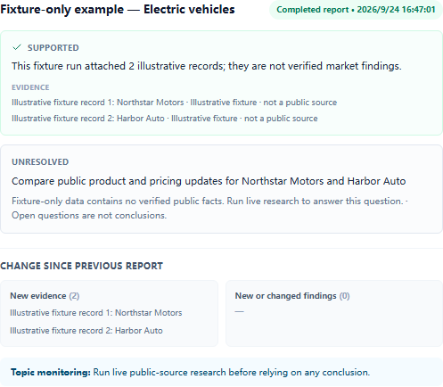
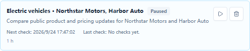

# Market Intelligence Agent

面向企业经营、战略和产品团队的桌面研究工作台。Agent 根据公开信息和每一步获得的证据，动态选择下一项研究动作，生成带来源、冲突与信息缺口的竞品和行业报告，并在应用运行时追踪新信息。

> 当前为 alpha。企业研究工作流及其桌面界面已实现；本页把确定性 fixture 验收与真实模型/公开搜索验证分开报告。桌面与 Agent 基础来自与 helsome 共同开发的 Folio，并保留其历史及贡献记录。

## 研究工作流

- 6 类研究任务：行业格局、竞品产品、价格与渠道、公开反馈、政策与技术风险、证据变化核查。
- 3 套策略：行业概览、竞品深挖、变化与风险追踪。策略调整任务优先级与检索预算；Agent 每一步只可选择公开检索、打开本次运行发现的来源或结束。
- 报告区分搜索摘要与已读取网页正文，保存引用、冲突、未解问题与证据等级。搜索摘要不会被标成已核验的网页正文。
- 订阅在应用运行期间按间隔检查；新来源或已知来源的实质变化可以触发后续研究，并与旧报告比较。应用关闭期间不承诺后台监控；重启后最多补做一次逾期检查。

系统只使用公开可访问的信息。网页中抽取的日期、产品或公开价格会保留来源 URL 和原文片段；公开评论只作为可能有偏的反馈信号，不等同于代表性客户调研。当前版本不接入企业内网、客户调研系统或独立的结构化企业数据服务。

## 验收结果

以下结果来自本地确定性 fixture 验收，不是实时模型准确率，也不代表真实市场结论。

| 指标 | 本次结果 | 统计口径与验收标准 |
| --- | --- | --- |
| 研究任务 / 策略 | 6 / 3 | 项目目录中的唯一任务 ID / 策略 ID；仅计本项目企业研究目录 |
| 可执行评测案例 | 24/24 通过；0 失败、0 排除 | 固定脚本决策与来源快照；完整目标要求 24/24 命中预期结果，不代表真实模型泛化能力 |
| 研究运行 | 22/22 已启动，0 未启动；17 completed、4 partial、1 failed、0 cancelled | 24 个案例按预期产生 22 次研究运行；按终态分别计数，未启动仍算案例失败 |
| 正常任务完成度 | 6/6（100%） | 正常任务中 completed 且满足必需章节和至少一条有效引证的案例 / 6；门槛 6/6 |
| 预期结果命中 | 24/24（100%） | 研究终态或监控触发/不触发均符合标注预期的案例 / 24；门槛 24/24 |
| 工具选择正确率 | 58/58（100%） | 所选动作及参数同时属于标注允许集合的检查点 / 全部检查点；固定案例门槛 100%；真实模型两组反事实验收仍待配置 |
| 引证有效率 / 事实覆盖率 | 17/17（100%） / 14/14（100%） | 有效且支持论断的引证 / 全部引证；有有效引证的事实性论断 / 全部事实性论断；固定案例两项门槛均为 100% |
| 冲突检测 / 故障恢复 | 3/3（100%） / 3/3（100%） | 检出的预期冲突 / 冲突案例；符合预期重试、降级或明确失败的恢复案例 / 3；门槛均为 3/3 |
| 自动触发精确率 / 召回率 | 2/2（100%） / 2/2（100%） | 正确触发 / 所有触发；正确触发 / 两个应触发案例；门槛均为 2/2，重复信号不得重复触发 |
| 评测运行时延 | 22 个样本；p50 16 ms、p95 21 ms、最大 28 ms | 可控 fixture 时钟下从研究运行开始到终态的样本；p50 为算术中位数，p95 为 nearest-rank；门槛 p95 ≤30,000 ms、单次 ≤60,000 ms |
| 评测工具时延 | 38 个样本；p95 5 ms | fixture 工具调用样本的 nearest-rank p95；仅用于固定案例验收，不代表线上网络时延 |
| 桌面研究流程 | 2 次持久化运行，各含 2 条 fixture 证据 | Windows Electron UI 本次点击至报告可见耗时见机器记录；单次本机观察，不是性能承诺 |
| 监控集成 | 3 次检查、2 次后续运行、重复信号被抑制 | 两个固定快照；0 次网络请求；本次耗时见机器记录，不代表真实网站延迟 |
| 重载与报告差异 | 通过 | 重载后运行、报告、事件和暂停状态仍可读取；第二次同主题运行显示 2 条新证据 |

比例分母为 0 时记为“不适用”，不能写成 100%；不得只报百分比或剔除失败样本。固定评测使用 scripted fixture 模型和固定来源快照，不调用模型供应商或 Brave Search。逐案结果、分子/分母、样本数、fixture 模型/来源版本、评测时间和本次 Windows 平台记录在[机器可读验收记录](docs/demos/business-research/fixture-verification.json)。真实模型反事实决策的门槛为两组输入都因证据差异产生有效后续决策分叉，且非法工具调用为 0；真实公开来源自动触发须实际完成一次后续研究。两项尚待配置后单独验收，不能用夹具结果替代。

真实模型的同主题反事实决策（不同证据导致不同的下一步工具选择）和真实公开搜索源的变化触发尚未完成验收；fixture 成绩不能替代这两项。它们需要配置真实模型与 Brave Search 凭证后单独执行。

验收截图：







[查看机器可读 fixture 验收记录](docs/demos/business-research/fixture-verification.json)。

## 技术结构

```text
React 工作台
   │ typed IPC
Electron 主进程 ── 持久化、凭证、调度、公开检索
   │
业务研究 Runtime ── Agent 决策 → 工具调用 → 观察 → 报告
   │
Folio 既有 Pi Agent 运行时与桌面基础
```

## 本地运行

需要 Bun 和 Node.js。安装依赖并启动桌面开发模式：

```bash
bun install
bun run dev
```

运行无需外部网络或 API 凭证的研究工作流验收：

```bash
bun run --filter @finagent/electron test:e2e:business-research
```

实时研究还需要可用的模型提供方和 Brave Search 凭证；凭证由应用主进程安全保存。fixture 示例明确标为说明性数据，不能当作实时结论。

真实模型与公开搜索验收使用独立的本地档案，不要把凭证写进仓库、命令参数或聊天。Windows PowerShell 示例：

```powershell
$liveProfile = Join-Path $env:LOCALAPPDATA 'Market-Intelligence-Agent\live-e2e'
bun run --filter @finagent/electron business-research:live-profile -- prepare "$liveProfile"
node apps/electron/e2e/business-research-live-profile.mjs open "$liveProfile"
```

应用窗口打开后，按需完成首次启动引导，在设置中配置模型提供方，并在 Market Intelligence 工作区配置 Brave Search。保存后回到终端按 Enter 关闭窗口；此档案会保留在本机供后续验收使用。脚本只会标记空目录或自己已标记的目录，并拒绝仓库内路径和未标记的非空目录。

关闭设置窗口后，在同一 PowerShell 会话中运行真实验收。它会访问 Brave Search 和模型提供方、在专用档案中创建并随后停用一条验收订阅，可能产生供应商用量费用：

```powershell
$env:FINAGENT_LIVE_E2E_USER_DATA_DIR = $liveProfile
bun run --filter @finagent/electron test:e2e:business-research:live
```

通过后会生成脱敏记录 `docs/demos/business-research/live-verification.json`；验收轨迹只保存有效动作、公开来源定位信息、内容哈希与耗时，不保存密钥或网页原文。

## 项目历史与贡献

我与 helsome 共同开发了 Folio。本仓库保留 Folio 的提交历史和既有贡献记录；Market Intelligence Agent 的企业研究领域、动态决策、公开信息追踪、评测集与演示材料在此仓库中实现并持续验证。Folio 原有的股票筛选、投资策略和评测案例不计为本项目新增的企业研究成果。

## 状态

当前验收边界：fixture 研究、持久化、报告差异、监控触发/去重和 UI 重载已通过；真实模型反事实决策与真实公开源监控仍待凭证配置后的现场验证。项目内的 6/3/24 是这套企业研究目录和案例数，不沿用 Folio 投资研究中的 17/8/86，也不宣称两组数字等价。
